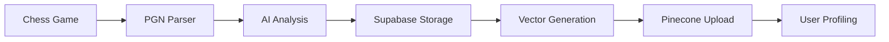

# Vector Database Integration Guide

This document explains how the new `rookify-vector-db` Pinecone index is integrated with the Rookify chess coaching application.

## Overview

The Rookify application now uses a sophisticated vector database system to provide:
- **Personalized chess recommendations**
- **Playing pattern analysis**
- **Similar position discovery**
- **Weakness identification**
- **Training position suggestions**

## New Vector Database Configuration

### Index Details
- **Name**: `rookify-vector-db`
- **Dimensions**: 1024 (using llama-text-embed-v2)
- **Metric**: Cosine similarity
- **Cloud**: GCP (europe-west4)
- **Host**: `https://rookify-vector-db-motvuzs.svc.gcp-europe-west4-defd.pinecone.io`

### Embedding Model
- **Primary**: `llama-text-embed-v2` (1024 dimensions)
- **Fallback**: OpenAI `text-embedding-3-small` (truncated to 1024)
- **Text Processing**: Enhanced context including position, move, commentary, and skill metadata

## Integration Components

### 1. Enhanced Data Pipeline



#### Key Files:
- `pinecone_upload.py` - Core vector operations
- `user_profiling_integration.py` - AI-powered user analysis
- `main.py` - API endpoints
- `sync_to_pinecone.py` - Batch sync utility

### 2. User Profiling System

The `UserProfiler` class provides advanced analytics:

```python
from user_profiling_integration import UserProfiler

profiler = UserProfiler()

# Analyze weaknesses
weaknesses = profiler.analyze_user_weaknesses("user-id")

# Find similar players
similar = profiler.find_similar_players("user-id", rating_range=100)

# Get training positions
positions = profiler.get_personalized_training_positions("user-id", skill_focus="Tactics")
```

#### Capabilities:
- **Pattern Recognition**: Identifies recurring mistakes by phase/skill
- **Similarity Matching**: Finds players with similar playing styles
- **Adaptive Training**: Suggests positions based on user weaknesses
- **Performance Tracking**: Monitors improvement over time

### 3. New API Endpoints

#### User Profile Analytics
```http
GET /user-profile/{user_id}/weaknesses?days=30
GET /user-profile/{user_id}/similar-players?rating_range=100
GET /user-profile/{user_id}/training-positions?skill_focus=Tactics&difficulty=adaptive
```

#### Enhanced Vector Search
```http
POST /vector-search/similar-positions
{
  "fen": "rnbqkbnr/pppppppp/8/8/8/8/PPPPPPPP/RNBQKBNR w KQkq - 0 1",
  "skill_category": "Tactics",
  "phase": "middlegame",
  "top_k": 10
}
```

#### Admin Monitoring
```http
GET /admin/vector-db/status
POST /admin/vector-db/sync
```

## Data Flow Architecture

### Game Analysis → Vector Storage

1. **Game Import**
   ```python
   # Enhanced game analysis with metadata extraction
   game_analysis = {
       'user_id': user_id,
       'game_url': game['url'],
       'platform': request.platform,
       'white_username': pgn_headers.get('white'),
       'black_username': pgn_headers.get('black'),
       'user_color': determine_user_color(request.username, pgn_headers),
       'opening_name': pgn_headers.get('opening'),
       'key_moments': analyzed_moments,
       # ... additional metadata
   }
   ```

2. **Vector Generation**
   ```python
   # Create rich text representation for embedding
   text_for_embedding = f"""
   Position: {moment.get('position_fen')}
   Move: {moment.get('move')}
   Commentary: {moment.get('commentary')}
   Phase: {moment.get('phase')}
   Skill Category: {moment.get('skill_category')}
   Opening: {game_data.get('opening_name')}
   """
   
   embedding = get_embedding(text_for_embedding)
   ```

3. **Metadata Structure**
   ```javascript
   {
     // Game context
     user_id: "uuid",
     game_id: "game-identifier", 
     color: "white|black",
     user_rating: 1500,
     opponent_rating: 1480,
     result: "1-0|0-1|1/2-1/2",
     
     // Position data
     fen: "position-string",
     move: "e4",
     move_number: 15,
     phase: "opening|middlegame|endgame",
     
     // Analysis
     eval_score: -0.5,
     stockfish_best: "Nf3",
     delta_cp: 25,
     accuracy_class: "balanced|mistake|blunder",
     
     // Learning context
     skill_category: "Tactics|Strategy|Openings|Endgames",
     sub_skill: "Pins|Forks|Pawn Structure",
     commentary: "Detailed explanation...",
     opening_name: "Sicilian Defense",
     
     // Metadata
     is_tactical_puzzle: true,
     is_brilliant: false,
     game_url: "https://chess.com/game/123"
   }
   ```

### Query & Recommendation System

1. **Similarity Search**
   ```python
   # Find positions similar to current situation
   results = query_vector_db(
       query_text="tactical pin middlegame",
       user_id="user-123",
       skill_category="Tactics",
       top_k=10
   )
   ```

2. **Personalized Recommendations**
   ```python
   # AI-powered weakness analysis
   patterns = analyze_mistake_patterns(user_mistakes)
   recommendations = generate_improvement_plan(patterns)
   ```

3. **Training Position Selection**
   ```python
   # Adaptive difficulty based on user performance
   positions = get_personalized_training_positions(
       user_id=user_id,
       skill_focus=detected_weakness,
       difficulty="adaptive"
   )
   ```

## Configuration & Setup

### Environment Variables

Create a `.env` file with:
```bash
# Pinecone Configuration
PINECONE_API_KEY=your_api_key
PINECONE_INDEX_NAME=rookify-vector-db
PINECONE_INFERENCE_HOST=https://rookify-vector-db-motvuzs.svc.gcp-europe-west4-defd.pinecone.io

# OpenAI Fallback
OPENAI_API_KEY=your_openai_key

# Supabase
SUPABASE_URL=your_supabase_url
SUPABASE_ANON_KEY=your_supabase_key
```

### Database Migration

Apply the enhanced schema:
```bash
psql -h your-host -d postgres -f migrations/update_schema_for_pinecone_compatibility.sql
```

### Initial Data Sync

Sync existing games to the vector database:
```bash
# Sync all unsynced games
python sync_to_pinecone.py

# Sync specific user
python sync_to_pinecone.py --user-id "user-uuid"

# Test with limited data
python sync_to_pinecone.py --limit 10 --dry-run
```

## Usage Examples

### Frontend Integration

```javascript
// Get user's weakness analysis
const weaknesses = await fetch(`/user-profile/${userId}/weaknesses`);
const analysis = await weaknesses.json();

// Display personalized recommendations
analysis.recommendations.forEach(rec => {
    displayRecommendation(rec.recommendation, rec.priority);
});

// Get training positions
const training = await fetch(`/user-profile/${userId}/training-positions?skill_focus=Tactics`);
const positions = await training.json();

// Display interactive training board
positions.training_positions.forEach(pos => {
    displayTrainingPosition(pos.fen, pos.commentary);
});
```

### Backend Usage

```python
# In your game analysis endpoint
from user_profiling_integration import UserProfiler

profiler = UserProfiler()

# After analyzing a game, update user profile
weaknesses = profiler.analyze_user_weaknesses(user_id)

# Generate recommendations
recommendations = profiler.get_personalized_training_positions(
    user_id, 
    skill_focus=weaknesses['top_weakness']
)

return {
    'game_analysis': analysis,
    'recommendations': recommendations,
    'weaknesses': weaknesses
}
```

## Performance & Monitoring

### Vector Database Health

Monitor your vector database with:
```bash
# Check connection and stats
curl GET /admin/vector-db/status

# Response includes:
{
  "status": "healthy",
  "vector_stats": {
    "total_vectors": 15420,
    "dimension": 1024,
    "fullness": 0.12
  },
  "sync_status": {
    "total_games_in_supabase": 1250,
    "games_synced_to_pinecone": 1180,
    "sync_percentage": 94.4
  }
}
```

### Performance Optimization

1. **Batch Operations**: Upload vectors in batches of 100
2. **Selective Sync**: Only sync games with meaningful analysis
3. **Query Optimization**: Use appropriate filters to reduce search space
4. **Caching**: Cache user profiles for frequently accessed data

### Error Handling

The system includes robust error handling:
- **Embedding Failures**: Automatic fallback to OpenAI
- **Sync Errors**: Detailed logging and retry mechanisms
- **Query Timeouts**: Graceful degradation with cached results
- **Rate Limiting**: Built-in backoff for API limits

## Benefits & Use Cases

### For Chess Players

1. **Personalized Learning**
   - Identify specific weaknesses in your play
   - Get training positions tailored to your skill gaps
   - Track improvement over time

2. **Pattern Recognition**
   - Find similar positions from your games
   - Learn from other players' decisions in similar situations
   - Develop pattern recognition skills

3. **Strategic Insights**
   - Discover your playing style tendencies
   - Find players with similar styles to study
   - Get opening recommendations based on your preferences

### For Coaches

1. **Student Analysis**
   - Quickly identify student weaknesses
   - Generate personalized training plans
   - Track student progress with data

2. **Curriculum Development**
   - Create position libraries based on common weaknesses
   - Develop skill-specific training modules
   - Adapt difficulty based on student performance

### For Chess Platforms

1. **Enhanced Engagement**
   - Provide AI-powered insights to users
   - Increase training effectiveness
   - Reduce time to improvement

2. **Data-Driven Features**
   - Recommendation engines for training content
   - Matching systems for similar-strength players
   - Adaptive learning pathways

## Future Enhancements

### Planned Features

1. **Real-time Analysis**
   - Live game coaching suggestions
   - In-game weakness detection
   - Immediate feedback on moves

2. **Advanced Analytics**
   - Opening repertoire optimization
   - Time management analysis
   - Psychological pattern detection

3. **Social Features**
   - Study groups based on similar weaknesses
   - Peer-to-peer learning recommendations
   - Collaborative training sessions

4. **Machine Learning Integration**
   - Predictive performance modeling
   - Automated curriculum generation
   - Style evolution tracking

### Scalability Roadmap

1. **Multi-Region Deployment**
   - Regional vector databases for latency
   - Geo-distributed embedding generation
   - Edge caching for common queries

2. **Advanced Indexing**
   - Hierarchical skill taxonomies
   - Multi-modal embeddings (position + notation)
   - Temporal embedding evolution

3. **Integration Ecosystem**
   - Third-party chess platform APIs
   - Educational content management systems
   - Tournament and rating system integration

## Support & Troubleshooting

### Common Issues

1. **Embedding Dimension Mismatch**
   ```python
   # Automatic padding/truncation in pinecone_upload.py
   if len(vector['values']) != EMBEDDING_DIMENSIONS:
       vector['values'] = vector['values'][:EMBEDDING_DIMENSIONS]
   ```

2. **Sync Failures**
   ```bash
   # Check sync status
   python sync_to_pinecone.py --dry-run --limit 1
   
   # Manual retry for failed games
   python sync_to_pinecone.py --user-id "problematic-user"
   ```

3. **Query Performance**
   ```python
   # Use appropriate filters to reduce search space
   filter_conditions = {
       'user_rating': {'$gte': 1400, '$lte': 1600},
       'phase': 'middlegame',
       'skill_category': 'Tactics'
   }
   ```

### Monitoring Commands

```bash
# Vector database health check
curl -X GET "http://localhost:8000/admin/vector-db/status"

# Manual sync trigger
curl -X POST "http://localhost:8000/admin/vector-db/sync" \
  -H "Content-Type: application/json" \
  -d '{"limit": 10}'

# Check Pinecone directly
python -c "
from pinecone_upload import pc, PINECONE_INDEX_NAME
index = pc.Index(PINECONE_INDEX_NAME)
print(index.describe_index_stats())
"
```

The vector database integration transforms Rookify from a basic game analysis tool into a sophisticated, AI-powered chess coaching platform that adapts to each user's unique learning needs and playing style. 